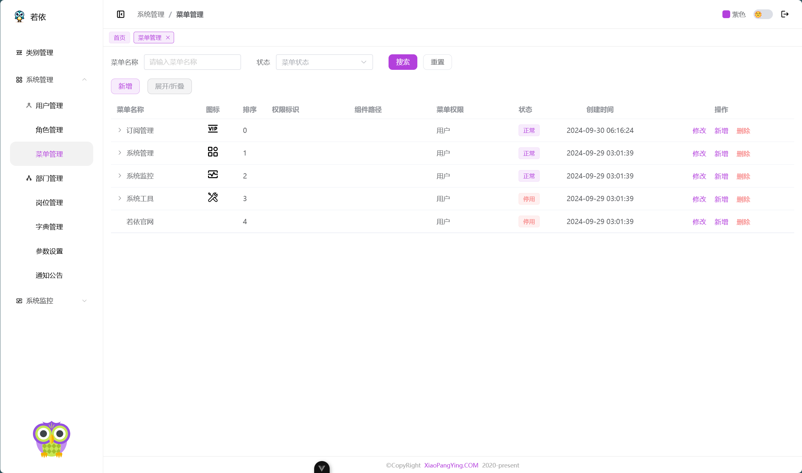
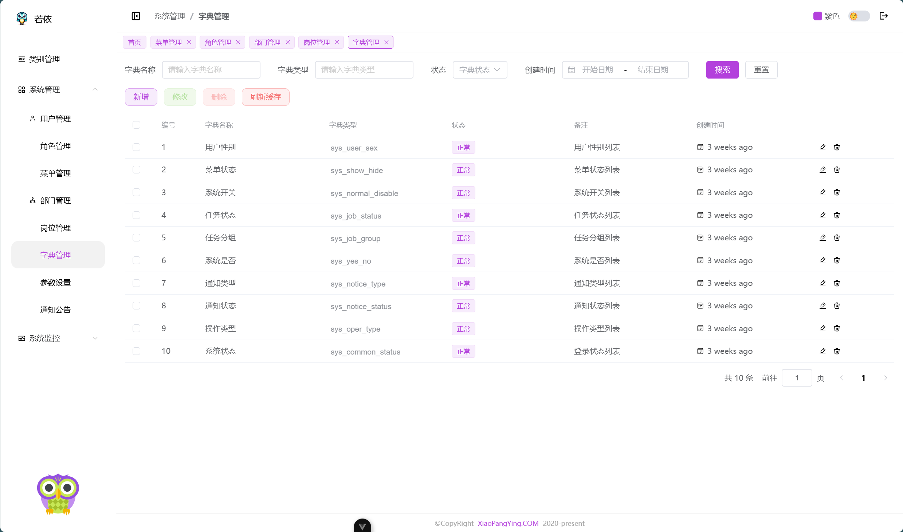
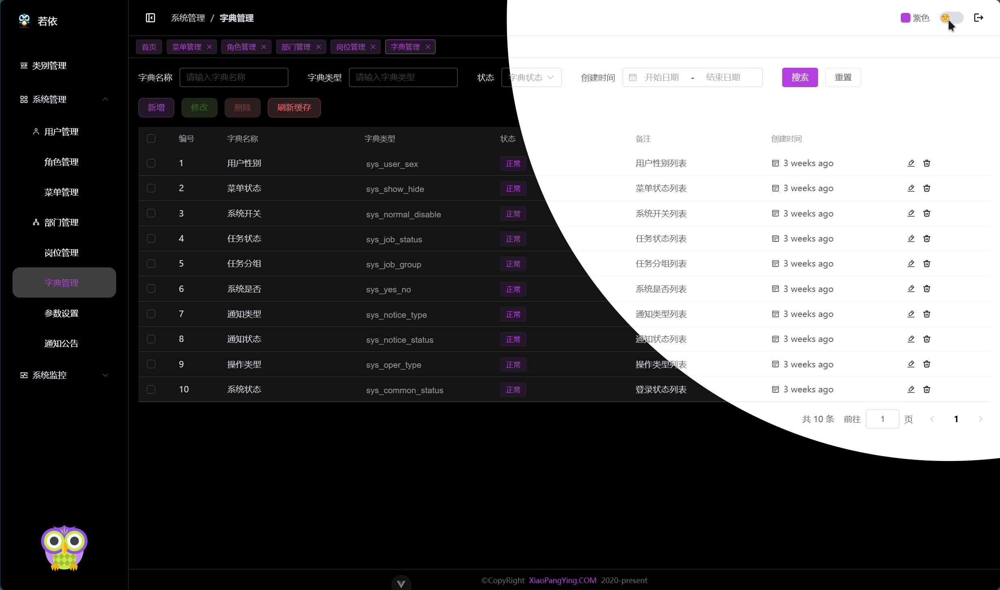
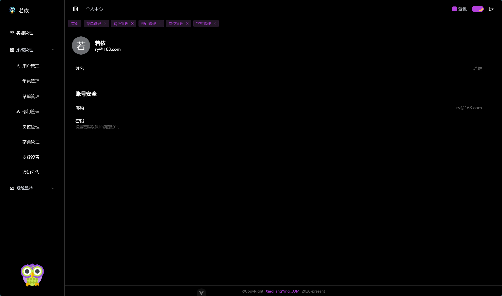
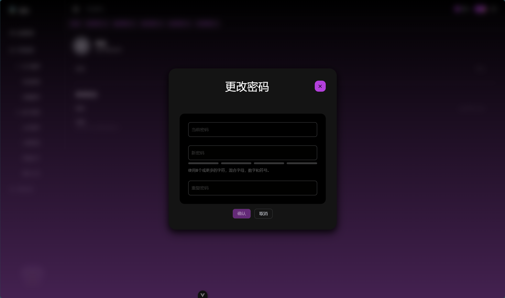
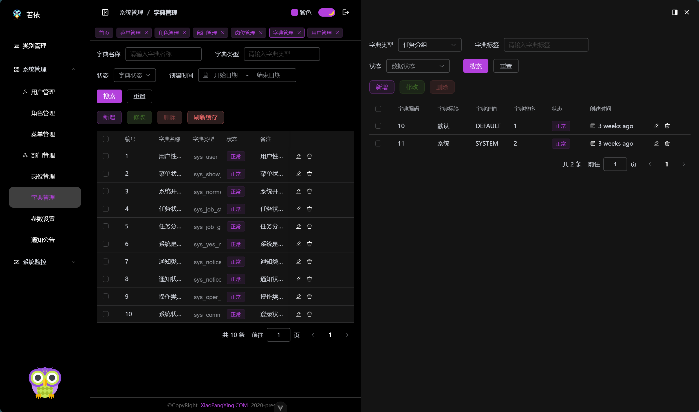
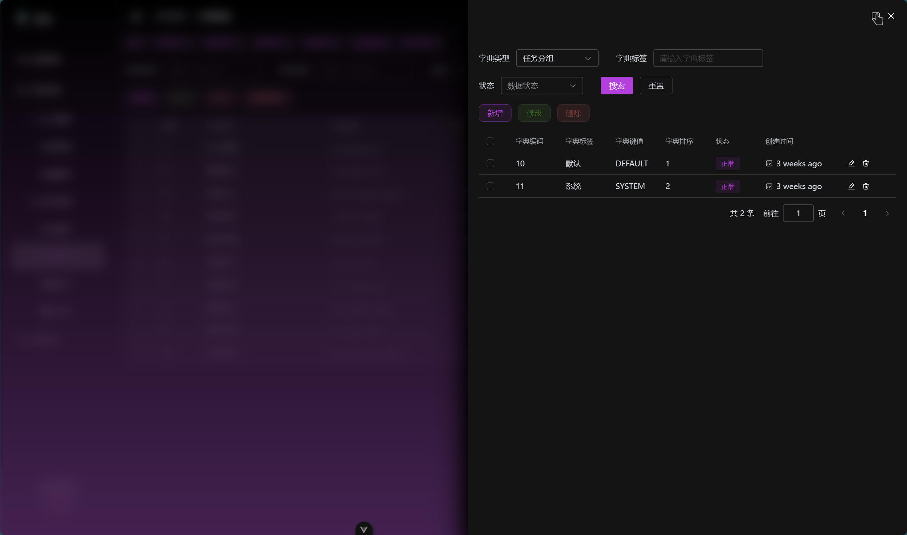

# 基于 vue3 的后台管理框架

> 魔改自以下内容：
>
> - [ruoyi-vue](https://gitee.com/y_project/RuoYi-Vue) 项目，感谢原作者的开源。
> - [v3-admin-vite](https://github.com/un-pany/v3-admin-vite) 项目，感谢作者开源。

## 初衷-它解决了什么问题

- 没有非常完美的前端后台管理框架
- v3-admin-vite 是我目前用过的比较好的框架。但是后端大部分基于 ruoyi，所以将它们整合了一下
- ruoyi 没有 vue3 版本（很多支持 vue3 的其他版本不太好用），也不支持 typescript，所以基本重写了一下
- 把样式重写了一遍，以 SnowUI 为基础，个人认为它好看很多
- 所有组件都按照 vue3 推荐的写法重新编写，更贴合 vue3 使用

## 特性

- 支持亮暗切换
- 支持国际化
- 支持换肤
- 支持权限控制（基于ruoyi）
- 支持动态路由（基于ruoyi）
- 菜单自动查找（找不到会自动忽略该路由，只打印警告提示）
- 支持页面缓存
- 基本重写了所有若依基础页面
- 基于 ruoyi 的动态字典
- 支持上万种图标（基于iconify）
- 编写了很多必要组件
- 更好的表格的使用方式（包括数据获取、分页筛选、表格配置等）
- 更多样的抽屉选择（支持页内、悬浮等方式切换）
- 融合了两个框架，外加手写的路由动态配置，使用起来更灵活方便
- 基于 unocss 的样式配置，更加方便
- 使用 pinia 而非 vuex 来管理状态，更加贴合使用习惯
- 炫酷的亮暗切换动画

## 截图

